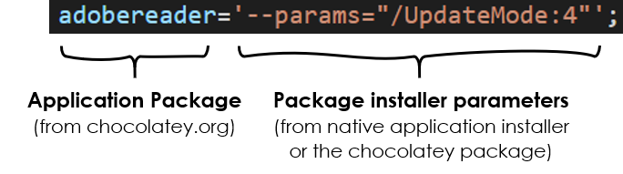

# The Choco Vanilla Package


# Motivation

When you set up a new Windows PC, you have to install a bunch of basic software. Examples are a browser, PDF reader, text editor, zipping program, and so on. Doing this frequently gets exhausting, especially when you also have to administer devices for your friends and family.


Luckily, with [Chocolatey](https://chocolatey.org/) there is a package manager for Windows. It allows you to install and update most of the software you know directly from the command line.

>I created a PowerShell script for Chocolatey which installs common freeware applications and optionally tools for more advanced uses, like git and VS Code. All fully customizable.

*With this script, you can set up a *vanilla* Windows PC within minutes.*

# Short installation instructions
Install [Chocolatey](https://chocolatey.org/), download the script, and run it. You will be asked if the basic apps bundle or developer apps bundle should be installed. Chocolatey then pulls the applications from the official servers and installs them in the background.

For a more detailed description see section [below](#detailed-installation-instructions).

# Included Applications
 
All applications are very common freeware, so I refer you to the corresponding websites for further explanation. 

Which of the apps are to be installed can be fully customized and extended. Simply delete, uncomment or add lines in the script.

(: Installed by default, : Optionally installed )

### Basic Application Bundle

<table class="tg">
<thead>
  <tr>
    <th class="tg-8l38">Category</th>
    <th class="tg-8l38" style="width: 33%;">Applications</th>
    <th class="tg-8l38">Comments</th>
  </tr>
</thead>
<tbody>
  <tr>
    <td class="tg-z8l7">Media Viewers</td>
    <td class="tg-8l38">
        <a href="https://www.7-zip.org/"> 7zip</a><br/>
        <a href="https://notepad-plus-plus.org/"> Notepad++</a><br/>
        <a href="https://www.videolan.org"> VLC Player</a><br/>
        <a href="https://www.irfanview.com/"> IrfanView (incl. Plugins)</a><br/>
        <a href="https://acrobat.adobe.com/us/en/acrobat/pdf-reader.html"> Adobe Reader</a><br/>
        <a href="https://www.foxitsoftware.com/pdf-reader/"> Foxit Reader</a><br/>
    </td>
    <td class="tg-8l38">Common freewares for all media formats (images &amp; movies), texts files, .zips, .raws, and PDFs.<br>For PDFs you can stick with the default Adobe Reader or alternatively choose Foxit Reader (my recommendation).</td>
  </tr>
  <tr>
    <td class="tg-z8l7">Browsers</td>
    <td class="tg-8l38">
        <a href="https://www.google.com/intl/en_us/chrome/"> Google Chrome</a><br/>
        <a href="https://www.mozilla.org/en-US/firefox/new/"> Mozilla Firefox</a><br/>
        <a href="https://www.opera.com"> Opera</a><br/>
    </td>
    <td class="tg-8l38">Google Chrome will be installed by default. Alternatively, choose Firefox or Opera.</td>
  </tr>
  <tr>
    <td class="tg-z8l7">File Sync</td>
    <td class="tg-8l38">
        <a href="https://www.dropbox.com"> Dropbox</a><br/>
        <a href="https://www.google.com/drive/"> Google Drive</a><br/>
    </td>
    <td class="tg-8l38">Microsoft OneDrive is pre-installed on every Windows 10 system, so you probably won't need the others.</td>
  </tr>
  <tr>
    <td class="tg-z8l7">Collaboration</td>
    <td class="tg-8l38">
        <a href="https://zoom.us"> Zoom</a><br/>
        <a href="https://www.microsoft.com/en-us/microsoft-365/microsoft-teams/download-app"> Microsoft Teams</a><br/>
        <a href="https://discord.com/"> Discord</a><br/>
    </td>
    <td class="tg-8l38">Zoom and Microsoft Teams are common video conference tools (both personal and corporate). Zoom may be not allowed in your company, in this case, you should disable it. Discord is for all the tech-people out there (disabled by default)</td>
  </tr>
  <tr>
    <td class="tg-z8l7">System administration</td>
    <td class="tg-8l38">
        <a href="https://chocolatey.org/packages/ChocolateyGUI"> Chocolatey GUI</a><br/>
        <a href="https://windirstat.net/"> WinDirStat</a><br/>
        <a href="https://www.teamviewer.com/"> TeamViewer</a><br/>
        <a href="https://www.cpuid.com/softwares/cpu-z.html"> CPU-Z</a><br/>
        <a href="https://freecommander.com/en/summary/"> FreeCommander XE</a><br/>
    </td>
    <td class="tg-8l38">These tools help for a better system administration on your machine. Check the links or disable if you don't know them.</td>
  </tr>
  <tr>
    <td class="tg-z8l7">Crypto</td>
    <td class="tg-8l38">
        <a href="https://keepass.info/"> KeePass</a><br/>
        <a href="https://www.veracrypt.fr/en/Home.html"> Veracrypt</a><br/>
    </td>
    <td class="tg-8l38">KeePass is a lean open-source password manager. VeraCrypt is the successor of TrueCrypt (hard disk encryption).</td>
  </tr>
</tbody>
</table>


### Developer Application Bundle

<table class="tg">
<thead>
  <tr>
    <th class="tg-8l38">Category</th>
    <th class="tg-8l38" style="width: 33%;">Applications</th>
    <th class="tg-8l38">Comments</th>
  </tr>
</thead>
<tbody>
  <tr>
    <td class="tg-z8l7">General</td>
    <td class="tg-8l38">
        <a href="https://code.visualstudio.com/"> Visual Studio Code</a><br/>
        <a href="https://git-scm.com/"> git</a><br/>
        <a href="https://desktop.github.com/"> GitHub Desktop</a><br/>
        <a href="https://www.sourcetreeapp.com/"> Sourcetree</a><br/>
    </td>
    <td class="tg-8l38">VS Code is a multipurpose coding editor. GitHub Desktop and Sourcetree are UIs for code management via git.</td>
  </tr>
  <tr>
    <td class="tg-z8l7">API Clients</td>
    <td class="tg-8l38">
        <a href="https://www.postman.com/"> Postman</a><br/>
        <a href="https://insomnia.rest/"> Insomnia</a><br/>
    </td>
    <td class="tg-8l38">Postman is a popular client for calling APIs. A leaner alternative is Insomnia, which I can really recommend. </td>
  </tr>
  <tr>
    <td class="tg-z8l7">Cloud</td>
    <td class="tg-8l38">
        <a href="https://docs.microsoft.com/de-de/cli/azure/"> Azure CLI</a><br/>
        <a href="https://github.com/99designs/aws-vault"> AWS Vault</a><br/>
    </td>
    <td class="tg-8l38">Azure CLI for local command-line development with Microsoft Azure  and AWS Vault for Amazon's AWS cloud. Both are not installed by default.</td>
  </tr>
  <tr>
    <td class="tg-z8l7">Software Languages</td>
    <td class="tg-8l38">
        <a href="https://docs.conda.io/en/latest/miniconda.html"> Anaconda (Miniconda)</a><br/>
        <a href="https://nodejs.org/"> Node.js</a><br/>
        <a href="https://github.com/dotnet/core"> DotNet Core</a><br/>
    </td>
    <td class="tg-8l38">Since Python is very common, I included the Miniconda management suite by default. Miniconda is the small version of Anaconda (without the bulk software). Other languages are hard to guess, please <a href="https://chocolatey.org/packages?q=">look them up</a> by yourself.</td>
  </tr>
</tbody>
</table>


### Applications that need to be installed manually

Currently, [Spotify](https://www.spotify.com/de/download/) fails upon installation and is therefore not included in the script. 

<br/>

# Detailed installation instructions


### Chocolatey installation

1. Open PowerShell as admin (`Win` +  `X` and select `PowerShell (Admin)`)
2. Paste in the following line. It executes the official [installment script](https://chocolatey.org/install.ps1) from Chocolatey. 

  ```	 
  Set-ExecutionPolicy Bypass -Scope Process -Force; [System.Net.ServicePointManager]::SecurityProtocol = [System.Net.ServicePointManager]::SecurityProtocol -bor 3072; iex ((New-Object System.Net.WebClient).DownloadString('https://chocolatey.org/install.ps1'))  
  ```

3. Chocolatey will be installed. It is normal that some warnings appear.

If you are behind a proxy, check these [instructions](https://chocolatey.org/docs/proxy-settings-for-chocolatey#installing-chocolatey-behind-a-proxy-server).


### Download and modify the Vanilla script

1. Clone this repo or download the .zip (then unzip the folder).
1. Navigate to the downloaded folder and open up the script `choco-install-apps.ps1` in *Edit* Mode (right-click menu)
1. Enable or disable needed applications. The `#` sign comments a line out (disables it), deleting the leading `#` sign enables the line. See also [section below](#script-content).
1. Save and close.

### Execute Vanilla Script
1. Open PowerShell as admin (`Win` +  `X` and select `PowerShell (Admin)`) and navigate to the downloaded folder.
1. Run the script `choco-install-apps.ps1`. If you should get an error, then local scripts are disabled on your machine. To enable them, type  
`PowerShell.exe -ExecutionPolicy UnRestricted -File choco-install-apps.ps1`
1. Wait and grab a **vanilla chocolate** :)


# Script Content

  The PowerShell script consists of a dictionary that contains the applications to install and their customized parameters (if needed). An example of a custom parameter is a different install location or the creation of a desktop shortcut.
  
  

  There is one dictionary for basic applications and one for development applications. The dictionary is selected on user-startup.


You probably want to tidy up your [Windows Explorer right-click menu](https://www.howtogeek.com/howto/windows-vista/how-to-clean-up-your-messy-windows-context-menu/).

If you have questions, just contact me.


--------------

<span>Photograph by <a href="https://unsplash.com/@crj2day?utm_source=unsplash&amp;utm_medium=referral&amp;utm_content=creditCopyText">Casey Johnson</a> on <a href="https://unsplash.com/?utm_source=unsplash&amp;utm_medium=referral&amp;utm_content=creditCopyText">Unsplash</a>.</span>
Image montage by me.


