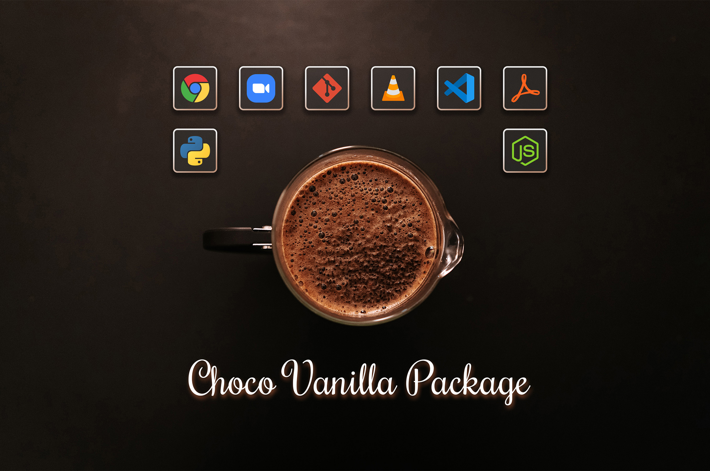

# The Choco Vanilla Package



# Motivation

When you setup a new Windows PC, you have to install a bunch of basic softwares. Examples are a browser, PDF reader, text editor, zipping program and so on. 
Doing this fequently gets exhausting, especially when you also have to  do administer devices for your friends and family.


Luckily, with [Chocolatey](https://chocolatey.org/) there is a package manager for Windows. It allows to manage software from the command line.

>I created a fully PowerShell script for Chocolatey which installs common freeware applications and optionally tools for more advanced uses (like git and VS Code).

*With this script you are able to setup a *vanilla* PC within minutes.* This is fully customizable.

# Short installation instructions
Install [Chocolatey](https://chocolatey.org/), download the script and run it. You will be asked if the basic apps bundle or developer apps bundle should be installed. Chocolatey then pulls the applications from the offical servers and installs it in the background.

For a more detailled description see section xxxxxxxxxxxx.

# Included Applications
 
All applications are very common freewares, so I refer you to the corresponding websites for further explanation. 

Which apps should be installed can be fully customized and enhanced. Just delete, uncomment or add apps in the script.

(: Installed by default, : Optionally installed )

### Basic Application Bundle

<table class="tg">
<thead>
  <tr>
    <th class="tg-8l38">Category</th>
    <th class="tg-8l38" style="width: 33%;">Applications</th>
    <th class="tg-8l38">Comments</th>
  </tr>
</thead>
<tbody>
  <tr>
    <td class="tg-z8l7">Media Viewers</td>
    <td class="tg-8l38">
        <a href="https://www.7-zip.org/"> 7zip</a><br/>
        <a href="https://notepad-plus-plus.org/"> Notepad++</a><br/>
        <a href="https://www.videolan.org"> VLC Player</a><br/>
        <a href="https://www.irfanview.com/"> IrfanView (incl. Plugins)</a><br/>
        <a href="https://acrobat.adobe.com/us/en/acrobat/pdf-reader.html"> Adobe Reader</a><br/>
        <a href="https://www.foxitsoftware.com/de/pdf-reader/"> Foxit Reader</a><br/>
    </td>
    <td class="tg-8l38">Common freewares for all media formats (images &amp; movies), texts files, .zips, .raws, and PDFs.<br>For PDFs you can stick with the default Adobe Reader or alternativly choose Foxit Reader (my recoomendation).</td>
  </tr>
  <tr>
    <td class="tg-z8l7">Browsers</td>
    <td class="tg-8l38">
        <a href="https://www.google.com/intl/en_us/chrome/"> Google Chrome</a><br/>
        <a href="https://www.mozilla.org/en-US/firefox/new/"> Mozilla Firefox</a><br/>
        <a href="https://www.opera.com"> Opera</a><br/>
    </td>
    <td class="tg-8l38">Goolge Chrome will be installed by default. Alternatively choose Firefox or Opera.</td>
  </tr>
  <tr>
    <td class="tg-z8l7">File Sync</td>
    <td class="tg-8l38">
        <a href="https://www.dropbox.com"> Dropbox</a><br/>
        <a href=""> Google Drive</a><br/>
    </td>
    <td class="tg-8l38">Microsoft OneDrive is pre-installed on every Windows 10 system, so you probably won't need the others.</td>
  </tr>
  <tr>
    <td class="tg-z8l7">Collaboration</td>
    <td class="tg-8l38">
        <a href="https://zoom.us"> Zoom</a><br/>
        <a href="https://www.microsoft.com/en-us/microsoft-365/microsoft-teams/download-app"> Microsoft Teams</a><br/>
        <a href="https://discord.com/"> Discord</a><br/>
    </td>
    <td class="tg-8l38">Zoom and Microsoft Teams are common video conference tools (both personal and corporate). Zoom may be not allowed in your company, in this case you should disable it. Discord is for all the tech-people out there (disabled by default)</td>
  </tr>
  <tr>
    <td class="tg-z8l7">System administration</td>
    <td class="tg-8l38">
        <a href="https://chocolatey.org/packages/ChocolateyGUI"> Chocolatey GUI</a><br/>
        <a href="https://windirstat.net/"> WinDirStat</a><br/>
        <a href="https://www.teamviewer.com/de/"> TeamViewer</a><br/>
        <a href="https://www.cpuid.com/softwares/cpu-z.html"> CPU-Z</a><br/>
        <a href="https://freecommander.com/en/summary/"> FreeCommander XE</a><br/>
    </td>
    <td class="tg-8l38">These tools help for a better system administration on your machine. Check the links if you don't know them.</td>
  </tr>
  <tr>
    <td class="tg-z8l7">Crypto</td>
    <td class="tg-8l38">
        <a href="https://keepass.info/"> KeePass</a><br/>
        <a href="https://www.veracrypt.fr/en/Home.html"> Veracrypt</a><br/>
    </td>
    <td class="tg-8l38">KeePass is a lean open source password manager. VeraCrypt the successor of TrueCrypt (harddisk encryption).</td>
  </tr>
</tbody>
</table>


### Developer Application Bundle

<table class="tg">
<thead>
  <tr>
    <th class="tg-8l38">Category</th>
    <th class="tg-8l38" style="width: 33%;">Applications</th>
    <th class="tg-8l38">Comments</th>
  </tr>
</thead>
<tbody>
  <tr>
    <td class="tg-z8l7">General</td>
    <td class="tg-8l38">
        <a href="https://code.visualstudio.com/"> Visual Studio Code</a><br/>
        <a href="https://git-scm.com/"> git</a><br/>
        <a href="https://desktop.github.com/"> GitHub Desktop</a><br/>
        <a href="https://www.sourcetreeapp.com/"> Sourcetree</a><br/>
    </td>
    <td class="tg-8l38">VS Code is a multipurpose coding editor. GitHub Desktop and Sourcetree are UIs for code management via git.</td>
  </tr>
  <tr>
    <td class="tg-z8l7">API Clients</td>
    <td class="tg-8l38">
        <a href="https://www.postman.com/"> Postman</a><br/>
        <a href="https://insomnia.rest/"> Insomnia</a><br/>
    </td>
    <td class="tg-8l38">Postman is a popular client for calling APIs. A leaner alternative is Insomnia which I can really recommend. </td>
  </tr>
  <tr>
    <td class="tg-z8l7">Cloud</td>
    <td class="tg-8l38">
        <a href="https://docs.microsoft.com/de-de/cli/azure/"> Azure CLI</a><br/>
        <a href="https://github.com/99designs/aws-vault"> AWS Vault</a><br/>
    </td>
    <td class="tg-8l38">Azure CLI for local command line development with Microsoft Azure  and AWS Vault for Amazons AWS cloud. Both not installed by default.</td>
  </tr>
  <tr>
    <td class="tg-z8l7">Software Languages</td>
    <td class="tg-8l38">
        <a href="https://docs.conda.io/en/latest/miniconda.html"> Anaconda (Miniconda)</a><br/>
        <a href="https://nodejs.org/"> Node.js</a><br/>
        <a href="https://github.com/dotnet/core"> DotNet Core</a><br/>
    </td>
    <td class="tg-8l38">Since Python is very common, I included the Miniconda managment suite by default. Miniconda is the small version of Anaconda (without the bulk software). The rest is hard to guess, please <a href="https://chocolatey.org/packages?q=">look it up</a> yourself.</td>
  </tr>
</tbody>
</table>

<br/>

#### Applications that need to be installed manually

Currently, [Spotify](https://www.spotify.com/de/download/) fails on installation and is therefore not included in the script. 


# Script Content

<details> <summary>UNFOLD</summary>
  <p>
  
  The PowerShell script consists out of a dictionary which contains the applications to install and their customized parameters (if needed). An example for a custom parameter is  a different install location or the creation of a desktop shortcut.

  There is one dictionary for basic applications and one for development applications. The dictionairy is selected on user startup (*remark:* dicts are called "hashtables" in PowerShell).

  </p>
</details>


# Customizing the script


- how to find the settings
- powershell escaping

- the special case of changing the installation location

    vlc=''; # Install Dir can only be set via registry


# Detailed installation instructions


### Chocolatey installation

1. Open PowerShell as admin: `Win` +  `X` and select `PowerShell (Admin)`
2. Paste in the following line. It executes the official [installment script](https://chocolatey.org/install.ps1) from Chocolatey. 

  ```	 
  Set-ExecutionPolicy Bypass -Scope Process -Force; [System.Net.ServicePointManager]::SecurityProtocol = [System.Net.ServicePointManager]::SecurityProtocol -bor 3072; iex ((New-Object System.Net.WebClient).DownloadString('https://chocolatey.org/install.ps1'))  
  ```

3. Chocolatey will be installed. It is normal that some warnings appear.

If you are behind a proxy, check these [instructions](https://chocolatey.org/docs/proxy-settings-for-chocolatey#installing-chocolatey-behind-a-proxy-server).


### Download and modify the Vanilla script

1. Clone this repo or click on the green "Code" button and then on `Download ZIP`. Unzip the downloaded folder.
2. In certain Windows editions the execution of PowerShell scripts is disabled by default. 

The execution of PowerShell Scripts is denied be default. Therefore you have to allow the file. 

You can either enable local scripts or your strgc+v the code into power shell.

run as admim

PowerShell.exe -ExecutionPolicy UnRestricted -File .\install-standard-apps.ps1


--------------

#### Image Contibution

<span>Photograph by <a href="https://unsplash.com/@crj2day?utm_source=unsplash&amp;utm_medium=referral&amp;utm_content=creditCopyText">Casey Johnson</a> on <a href="https://unsplash.com/?utm_source=unsplash&amp;utm_medium=referral&amp;utm_content=creditCopyText">Unsplash</a>.</span>
Image montage by me.


### Temp


<details> <summary>CLICK ME</summary>
  <p>
  </p>
</details>